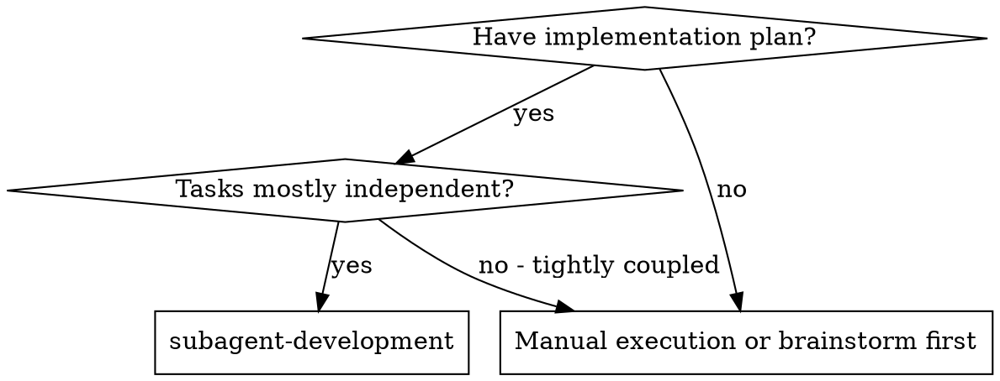
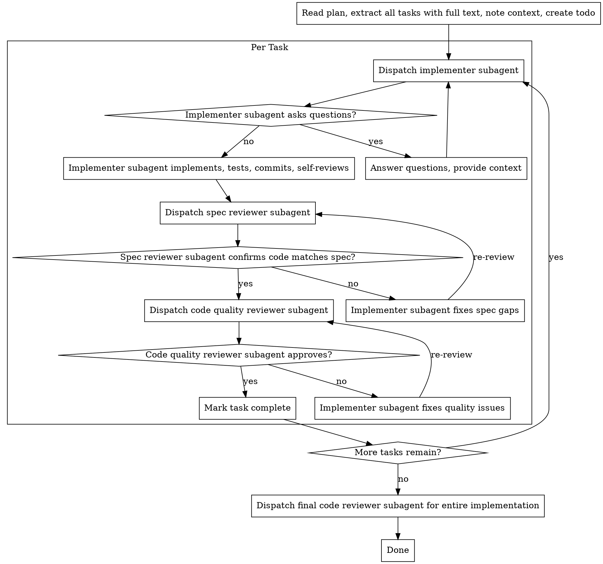

# Subagent-Driven Development

Execute a plan by dispatching a fresh subagent per task, with two-stage review after
each: spec compliance review first, then code quality review.

**Core principle:** Fresh subagent per task + two-stage review (spec then quality) =
high quality, fast iteration

## When to Use



**Key properties:**

- Fresh subagent per task (no context pollution)
- Two-stage review after each task: spec compliance first, then code quality
- Faster iteration (no human-in-loop between tasks)

## The Process



## Subagent Roles

Three Lua agents, dispatched via `agent`:

1. **Implementer** —
   `agent(action: "start", name: "coding-implementer", prompt: "<full task text + context>")`
   Implements a single task. Follows TDD, commits, self-reviews. May ask questions
   before starting.
2. **Spec reviewer** —
   `agent(action: "start", name: "coding-spec-reviewer", prompt: "<spec text>")` Checks
   that the implementation matches the spec exactly. Reports missing requirements and
   anything extra that was not requested.
3. **Code quality reviewer** —
   `agent(action: "start", name: "coding-quality-reviewer", prompt: "<scope>")` Reviews
   code quality only (after spec compliance is confirmed). Checks style, structure, test
   coverage, naming, etc.

After all tasks, dispatch the final reviewer:
`agent(action: "start", name: "coding-reviewer", prompt: "<overall scope>")`

## Step-by-Step

1. **Read the plan once.** Extract all tasks with full text and context. Do not make
   subagents read the plan file — provide the full text directly.
2. **Create a todo.** Use `todo(action: "plan", ...)` with all tasks from the plan.
3. **Per task:** a. Dispatch implementer subagent with full task text + scene-setting
   context. b. If the implementer asks questions, answer clearly and completely. Provide
   additional context if needed. Do not rush them into implementation. c. Implementer
   implements, writes tests, commits, and self-reviews. d. Dispatch spec reviewer
   subagent. If issues found, implementer fixes and spec reviewer reviews again. Repeat
   until approved. e. Dispatch code quality reviewer subagent. If issues found,
   implementer fixes and code quality reviewer reviews again. Repeat until approved. f.
   Mark task complete in the todo.
4. **After all tasks:** Dispatch the `coding-reviewer` agent for the entire
   implementation.
5. **Wrap up** using the finishing-a-development-branch workflow.

## Example Workflow

```
You: I'm using Subagent-Driven Development to execute this plan.

[Read plan file once: docs/plans/feature-plan.md]
[Extract all 5 tasks with full text and context]
[Create todo with all tasks]

Task 1: Hook installation script

[Get Task 1 text and context (already extracted)]
[Dispatch implementation subagent with full task text + context]

Implementer: "Before I begin - should the hook be installed at user or system level?"

You: "User level (~/.config/ghost/hooks/)"

Implementer: "Got it. Implementing now..."
[Later] Implementer:
  - Implemented install-hook command
  - Added tests, 5/5 passing
  - Self-review: Found I missed --force flag, added it
  - Committed

[Dispatch spec compliance reviewer]
Spec reviewer: Spec compliant - all requirements met, nothing extra

[Dispatch code quality reviewer]
Code reviewer: Strengths: Good test coverage, clean. Issues: None. Approved.

[Mark Task 1 complete]

Task 2: Recovery modes

[Get Task 2 text and context (already extracted)]
[Dispatch implementation subagent with full task text + context]

Implementer: [No questions, proceeds]
Implementer:
  - Added verify/repair modes
  - 8/8 tests passing
  - Self-review: All good
  - Committed

[Dispatch spec compliance reviewer]
Spec reviewer: Issues:
  - Missing: Progress reporting (spec says "report every 100 items")
  - Extra: Added --json flag (not requested)

[Implementer fixes issues]
Implementer: Removed --json flag, added progress reporting

[Spec reviewer reviews again]
Spec reviewer: Spec compliant now

[Dispatch code quality reviewer]
Code reviewer: Strengths: Solid. Issues (Important): Magic number (100)

[Implementer fixes]
Implementer: Extracted PROGRESS_INTERVAL constant

[Code reviewer reviews again]
Code reviewer: Approved

[Mark Task 2 complete]

...

[After all tasks]
[Dispatch final code-reviewer]
Final reviewer: All requirements met, ready to merge

Done!
```

## Advantages

**vs. Manual execution:**

- Subagents follow TDD naturally
- Fresh context per task (no confusion)
- Parallel-safe (subagents don't interfere)
- Subagent can ask questions (before AND during work)

**Efficiency gains:**

- No file reading overhead (controller provides full text)
- Controller curates exactly what context is needed
- Subagent gets complete information upfront
- Questions surfaced before work begins (not after)

**Quality gates:**

- Self-review catches issues before handoff
- Two-stage review: spec compliance, then code quality
- Review loops ensure fixes actually work
- Spec compliance prevents over/under-building
- Code quality ensures implementation is well-built

**Cost:**

- More subagent invocations (implementer + 2 reviewers per task)
- Controller does more prep work (extracting all tasks upfront)
- Review loops add iterations
- But catches issues early (cheaper than debugging later)

## Red Flags

**Never:**

- Start implementation on main/master branch without explicit OPERATOR consent
- Skip reviews (spec compliance OR code quality)
- Proceed with unfixed issues
- Dispatch multiple implementation subagents in parallel (conflicts)
- Make subagent read plan file (provide full text instead)
- Skip scene-setting context (subagent needs to understand where task fits)
- Ignore subagent questions (answer before letting them proceed)
- Accept "close enough" on spec compliance (spec reviewer found issues = not done)
- Skip review loops (reviewer found issues = implementer fixes = review again)
- Let implementer self-review replace actual review (both are needed)
- **Start code quality review before spec compliance is approved** (wrong order)
- Move to next task while either review has open issues

**If subagent asks questions:**

- Answer clearly and completely
- Provide additional context if needed
- Don't rush them into implementation

**If reviewer finds issues:**

- Implementer (same subagent) fixes them
- Reviewer reviews again
- Repeat until approved
- Don't skip the re-review

**If subagent fails task:**

- Dispatch fix subagent with specific instructions
- Don't try to fix manually (context pollution)

## Related

- Subagents follow TDD (test-driven development) for each task
- Use the finishing-a-development-branch workflow after all tasks are complete
- Prompt templates for reference: Read the `implementer-prompt.md`,
  `spec-reviewer-prompt.md`, and `code-quality-reviewer-prompt.md` extras
