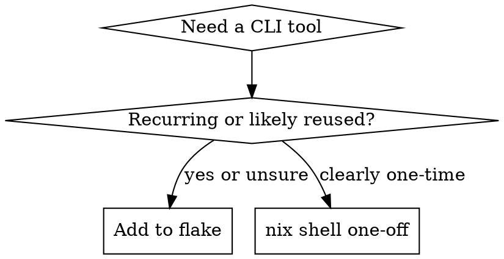

# System Management

Manage GHOST's shell environment, services, and self-update mechanism.

## Shell Environment

### Default: Install Permanently

When a tool is needed, decide based on expected reuse:

- **Recurring tool** (build tool, linter, language runtime, CLI used across sessions) --
  add to the flake permanently.
- **Rare/one-off binary** (single-use converter, one-time migration tool) -- use
  `nix shell` for a temporary run.

When unsure, install permanently. Removing a package later is trivial; losing time to a
missing tool in the next session is not.



| Rationalization                                    | Reality                                                                                       |
| -------------------------------------------------- | --------------------------------------------------------------------------------------------- |
| "I'll just try running it natively"                | If it's not on PATH, it's not installed. Add it to the flake or use `nix shell`. Never guess. |
| "`nix shell` / `nix run` is faster than the flake" | 30 seconds now vs the same missing-tool failure next session. Install it.                     |
| "Let me ask the OPERATOR first"                    | Permanent is the default for recurring tools. Only ask for genuinely ambiguous cases.         |
| "I don't know the nixpkgs package name"            | Run `nix search nixpkgs <query>` to find it. Never skip installation because of this.         |

### Adding Packages

Edit `$WORKSPACE/shell/flake.nix`, add to the `paths` list, then rebuild:

    paths = with pkgs; [
      # ... existing packages ...
      nodejs
    ];

    ghost shell rebuild

### Finding Package Names

    nix search nixpkgs <query>

Package names in nixpkgs sometimes differ from the command name. Always verify with
`nix search` before editing the flake.

### One-Off Tool Use (Exception)

For genuinely one-time tools -- a single-use converter, a quick format check:

    nix shell nixpkgs#<package> --command <tool> [args]

If the tool ends up being used more than once, stop and add it to the flake.

### Updating Shell Tools

Pull the latest nixpkgs (updates git, python, etc. -- NOT ghost):

    nix flake update --flake $WORKSPACE/shell/
    ghost shell rebuild

### Workspace Flake Architecture

`$WORKSPACE/shell/flake.nix` defines the shell tools as a `buildEnv` package. At daemon
boot, `nix build` creates a merged store path whose `bin/` is prepended to PATH.

The ghost binary is NOT in this flake -- it is installed system-wide via
`nix profile install` and available on PATH via `~/.nix-profile/bin/`.

## Services

GHOST's infrastructure has two tiers: **native services** (ghost-daemon, llama-server,
docling-serve) managed by the OS process supervisor, and **container services**
(searxng, crawl4ai, chrome) managed by Podman/Docker Compose.

Prefer `ghost` CLI commands over raw systemctl/launchctl/compose:

```
ghost start                   # start all services and the daemon
ghost stop                    # stop the daemon and all services

ghost services list           # show registered services and their state
ghost services add            # register a new service (interactive)
ghost services remove <name>  # unregister a service
ghost services update         # pull updates and restart all services
ghost services status         # check process-level status

ghost status                  # config validity + HTTP health probes
```

To reconfigure ports, credentials, or which services are enabled: `ghost init`.

For health check endpoints, troubleshooting, and log commands, consult
**`references/services.md`**.

## Self-Update

Update and restart GHOST:

    ghost update                     # latest release
    ghost update --from-source       # build from main
    ghost update --version v0.3.0    # specific tag

This swaps the ghost binary in the nix profile and reboots the daemon. Shell tools are
NOT affected -- they come from the workspace flake.

Run `ghost update` **in the background**, then tell the OPERATOR there will be a brief
downtime while restarting.

## Nix Garbage Collection

Reclaim disk space when store usage is high:

    nix-collect-garbage -d
    ghost version   # verify ghost still works after GC

## Additional References

- **`references/services.md`** -- health check endpoints, troubleshooting, log commands
- **`references/observability.md`** -- SigNoz traces, metrics, and logs via
  OpenTelemetry
- **`references/tailscale.md`** -- secure remote access to GHOST services over Tailscale
