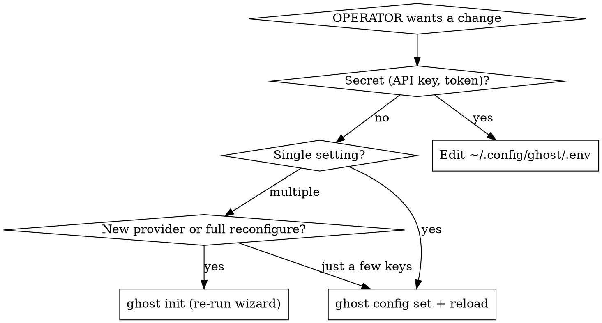
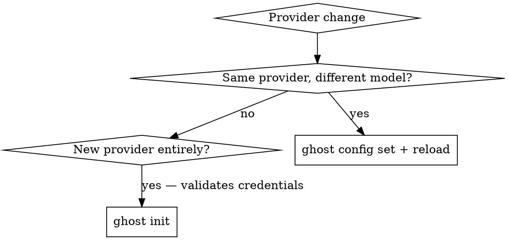
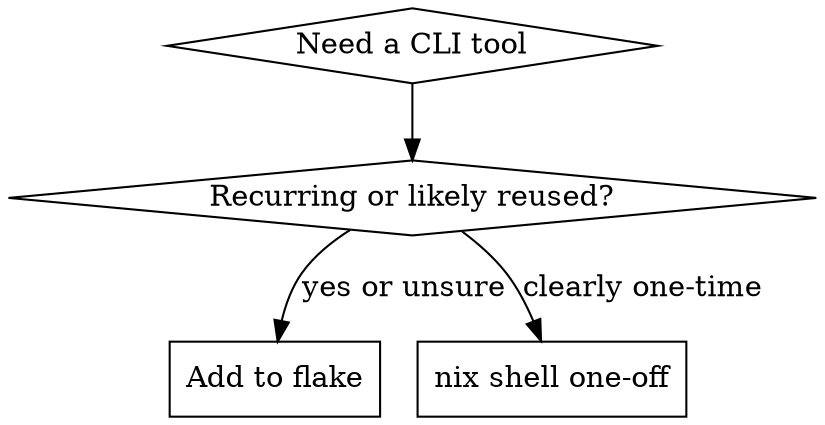

# System Management

Manage GHOST's configuration, providers, embedded documentation, shell environment,
services, and self-update mechanism.

## Self-Documentation

GHOST bundles its own documentation into the binary. On every daemon boot these docs are
extracted to `$WORKSPACE/references/ghost/docs/` and indexed as references under the
topic `ghost/docs`.

**When the OPERATOR asks how a GHOST feature works, always search the embedded docs
before answering.** Use the `knowledge_search` tool:

```
knowledge_search(query="<what the OPERATOR asked about>", topic="ghost", categories=["references"])
```

Topic prefix matching means `topic="ghost"` finds everything under `ghost/docs` too. Use
a specific query — `"compaction threshold"` not `"compaction"`.

If `knowledge_search` returns nothing useful, read the file directly:

    $WORKSPACE/references/ghost/docs/

Key doc paths for common questions:

| Topic | Doc path (under `references/ghost/docs/`) |
| --- | --- |
| Config options | `getting-started/configuration.md` |
| Providers & models | `ghost/providers.md` |
| Workspace layout | `getting-started/workspace.md` |
| Services setup | `getting-started/services.md` |
| Knowledge system | `knowledge/` |
| Agents & cron | `agents/` |
| Skills | `skills-and-tools/` |
| Sessions & chat | `chat/` |
| CLI reference | `reference/cli.md` |

| Rationalization | Reality |
| --- | --- |
| "I know how this feature works" | Training data may be stale. The embedded docs reflect the running version. Search first. |
| "I'll just read the source code" | Docs are faster and written for explanation. Read source only if docs don't answer it. |

## Configuration

### File Locations

- **Settings**: `~/.config/ghost/config.toml` (override: `GHOST_CONFIG_DIR` env var)
- **Secrets**: `~/.config/ghost/.env` — API keys, bot tokens. Never put secrets in
  config.toml.

### Reading & Writing Config

```
ghost config get <key>              # read a value (defaults applied)
ghost config set <key> <value>      # write a value (validates before saving)
ghost config reload                 # signal daemon to pick up changes (SIGHUP)
```

Keys use **dot-notation** for nested values:

```
ghost config get models.primary.model
ghost config set models.primary.model "anthropic/claude-sonnet-4"
ghost config set compaction.threshold 0.85
ghost config set web.search_max_results 10
ghost config reload
```

The `set` command parses TOML syntax — numbers, booleans, strings, and inline tables all
work. Model aliases require both `provider` and `model` keys.

### Decision: How to Change Config



### Hot-Reload vs Restart

Most settings take effect after `ghost config reload`. A few require a full daemon
restart (`ghost reboot`):

| Requires restart | Hot-reloadable |
| --- | --- |
| `workspace` (directory path) | `models.*.model`, `models.*.context_window` |
| `embeddings.dimension` (invalidates stored vectors) | `timing.*` (idle, scheduler tick) |
| `discord.enabled` (interface toggle) | `compaction.*` (threshold, limits) |
| | `web.*` (search provider, results, crawl URL) |
| | `docling.*` (URL, timeout) |
| | `coding.model` |
| | `debug.*` (request saving) |
| | `discord.allowed_user_id` |
| | `embeddings.url`, `embeddings.model` |

### Key Config Reference

For the full reference, search the embedded docs:

```
knowledge_search(query="config.toml reference", topic="ghost", categories=["references"])
```

Quick reference for common keys:

| Key | Example value | What it controls |
| --- | --- | --- |
| `models.default` | `"primary"` or `["primary", "fallback"]` | Default model alias (or fallback chain) |
| `models.<alias>.provider` | `"openrouter"` | Provider backend for this alias |
| `models.<alias>.model` | `"anthropic/claude-sonnet-4"` | Model ID at the provider |
| `models.<alias>.context_window` | `200000` | Token limit for this model |
| `models.vision` | `"fast"` | Model alias used for vision/PDF tasks |
| `discord.allowed_user_id` | `"123456789"` | OPERATOR's Discord user ID |
| `embeddings.url` | `"http://127.0.0.1:11434"` | Embedding endpoint (Ollama) |
| `embeddings.model` | `"qwen3-embedding:8b"` | Embedding model name |
| `timing.reflection_idle_minutes` | `10` | Minutes idle before reflection |
| `compaction.threshold` | `0.90` | Compact at this % of context window |
| `web.search.provider` | `"brave"` or `"searxng"` | Web search backend |
| `debug.save_requests` | `false` | Save raw LLM request/response dumps |

| Rationalization | Reality |
| --- | --- |
| "I'll just edit config.toml directly" | Use `ghost config set` — it validates before writing and catches syntax errors. |
| "I need to restart for this to take effect" | Most settings are hot-reloadable. Check the table above. |
| "I don't know what config keys exist" | Search embedded docs: `knowledge_search(query="configuration", topic="ghost")` |

## Provider Management

### Supported Providers

| Provider | Config value | Auth | Env var |
| --- | --- | --- | --- |
| OpenRouter | `openrouter` | API key | `OPENROUTER_API_KEY` |
| Kimi Code | `kimi_code` | API key | `KIMI_API_KEY` |
| Anthropic | `anthropic` | Claude Code OAuth | — |
| OpenAI OAuth | `openai_oauth` | Device code flow | — |

Use the config values from this table exactly — they match the `ProviderKind` enum.

### Common Operations

**View current provider:**

    ghost config get models.primary

**Switch model (same provider):**

    ghost config set models.primary.model "new-model-id"
    ghost config reload

**Add a new provider** — re-run the setup wizard. It validates credentials with a real
API call before saving:

    ghost init --provider openrouter --api-key sk-... --model anthropic/claude-sonnet-4 --context-window 200000

Pass `--start` to restart services after. If run without flags, `ghost init` enters
interactive mode and prompts for each value.

**Change an API key:**

Edit `~/.config/ghost/.env` directly, then:

    ghost config reload

**Validate setup:**

    ghost status

This checks config validity and probes every configured service endpoint.

### Decision: When to Use `ghost init` vs `ghost config set`



Use `ghost init` for new providers because it tests the connection before saving. For
simple model swaps on an existing provider, `ghost config set` + `reload` is faster.

| Rationalization | Reality |
| --- | --- |
| "I'll guess the provider name" | Use the exact `ProviderKind` values from the table: `openrouter`, `kimi_code`, `openai_oauth`, `anthropic`. |
| "I can set the API key in config.toml" | API keys go in `.env`, never in config.toml. Config is not secret. |
| "I'll skip validation, it's probably fine" | `ghost init` validates with a real API call. Use it for new providers. `ghost status` for existing ones. |

## Services

GHOST's infrastructure has two tiers: **native services** (ghost-daemon, llama-server,
docling-serve) managed by the OS process supervisor, and **container services**
(searxng, crawl4ai, chrome) managed by Podman/Docker Compose.

Prefer `ghost` CLI commands over raw systemctl/launchctl/compose:

```
ghost start                   # start all services and the daemon
ghost stop                    # stop the daemon and all services

ghost services list           # show registered services and their state
ghost services add            # register a new service (interactive)
ghost services remove <name>  # unregister a service
ghost services update         # pull updates and restart all services
ghost services status         # check process-level status

ghost status                  # config validity + HTTP health probes
```

To reconfigure ports, credentials, or which services are enabled: `ghost init`.

For health check endpoints, troubleshooting, and log commands, consult
**`references/services.md`**.

## Shell Environment

### Default: Install Permanently

When a tool is needed, decide based on expected reuse:

- **Recurring tool** (build tool, linter, language runtime, CLI used across sessions) --
  add to the flake permanently.
- **Rare/one-off binary** (single-use converter, one-time migration tool) -- use
  `nix shell` for a temporary run.

When unsure, install permanently. Removing a package later is trivial; losing time to a
missing tool in the next session is not.



| Rationalization                                    | Reality                                                                                       |
| -------------------------------------------------- | --------------------------------------------------------------------------------------------- |
| "I'll just try running it natively"                | If it's not on PATH, it's not installed. Add it to the flake or use `nix shell`. Never guess. |
| "`nix shell` / `nix run` is faster than the flake" | 30 seconds now vs the same missing-tool failure next session. Install it.                     |
| "Let me ask the OPERATOR first"                    | Permanent is the default for recurring tools. Only ask for genuinely ambiguous cases.         |
| "I don't know the nixpkgs package name"            | Run `nix search nixpkgs <query>` to find it. Never skip installation because of this.         |

### Adding Packages

Edit `$WORKSPACE/shell/flake.nix`, add to the `paths` list, then rebuild:

    paths = with pkgs; [
      # ... existing packages ...
      nodejs
    ];

    ghost shell rebuild

### Finding Package Names

    nix search nixpkgs <query>

Package names in nixpkgs sometimes differ from the command name. Always verify with
`nix search` before editing the flake.

### One-Off Tool Use (Exception)

For genuinely one-time tools -- a single-use converter, a quick format check:

    nix shell nixpkgs#<package> --command <tool> [args]

If the tool ends up being used more than once, stop and add it to the flake.

### Updating Shell Tools

Pull the latest nixpkgs (updates git, python, etc. -- NOT ghost):

    nix flake update --flake $WORKSPACE/shell/
    ghost shell rebuild

### Workspace Flake Architecture

`$WORKSPACE/shell/flake.nix` defines the shell tools as a `buildEnv` package. At daemon
boot, `nix build` creates a merged store path whose `bin/` is prepended to PATH.

The ghost binary is NOT in this flake -- it is installed system-wide via
`nix profile install` and available on PATH via `~/.nix-profile/bin/`.

## Self-Update

Update and restart GHOST:

    ghost update                     # latest release
    ghost update --from-source       # build from main
    ghost update --version v0.3.0    # specific tag

This swaps the ghost binary in the nix profile and reboots the daemon. Shell tools are
NOT affected -- they come from the workspace flake.

Run `ghost update` **in the background**, then tell the OPERATOR there will be a brief
downtime while restarting.

## Nix Garbage Collection

Reclaim disk space when store usage is high:

    nix-collect-garbage -d
    ghost version   # verify ghost still works after GC

## Additional References

- **`references/services.md`** -- health check endpoints, troubleshooting, log commands
- **`references/observability.md`** -- SigNoz traces, metrics, and logs via
  OpenTelemetry
- **`references/tailscale.md`** -- secure remote access to GHOST services over Tailscale
